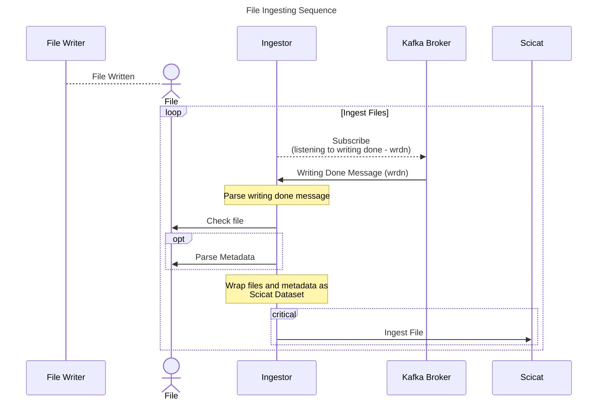

```mermaid
---
title: File Ingesting Sequence
---

sequenceDiagram
  create participant File Writer
  create actor File
  File Writer --> File: File Written
  loop Ingest Files
    Ingestor -->> Kafka Broker: Subscribe<br>(listening to writing done - wrdn)
    Kafka Broker ->> Ingestor: Writing Done Message (wrdn)
    Note over Ingestor: Parse writing done message
    Ingestor ->> File: Check file
    opt
        Ingestor ->> File: Parse Metadata
    end
    Note over Ingestor: Wrap files and metadata as<br> Scicat Dataset
    critical
        Ingestor ->> Scicat: Ingest File
    end
  end

```
