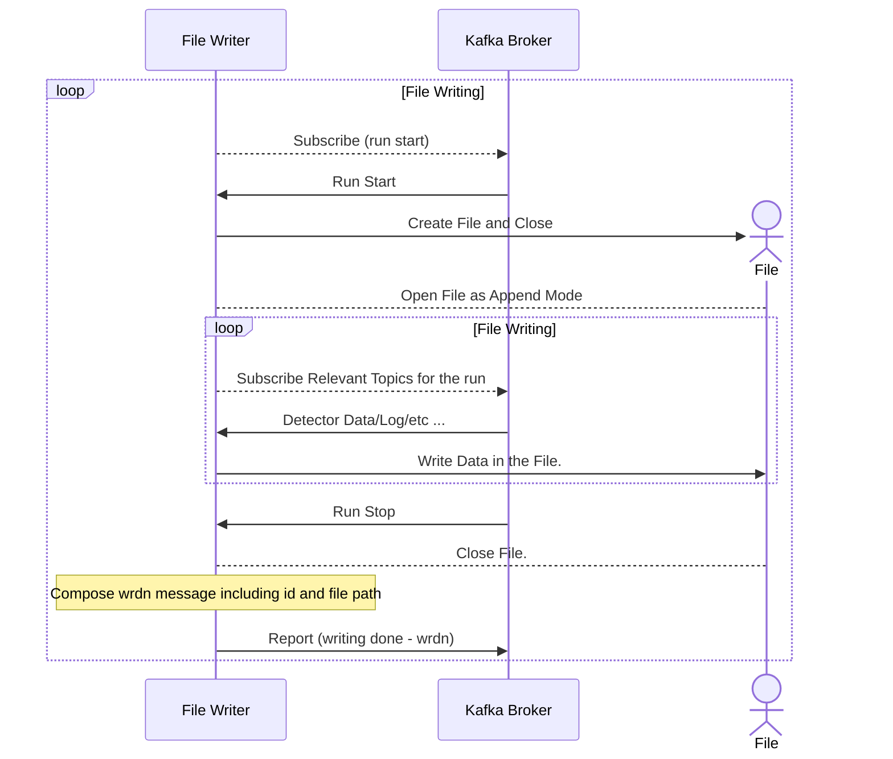

```mermaid
sequenceDiagram
loop File Writing
    File Writer -->> Kafka Broker: Subscribe (run start)
    Kafka Broker ->> File Writer: Run Start
    create actor File
    File Writer ->> File: Create File and Close
    File Writer --> File: Open File as Append Mode
    loop File Writing
        File Writer -->> Kafka Broker: Subscribe Relevant Topics for the run
        Kafka Broker ->> File Writer: Detector Data/Log/etc ...
        File Writer ->> File: Write Data in the File.
    end
    Kafka Broker ->> File Writer: Run Stop
    File Writer --> File: Close File.
    Note over File Writer: Compose wrdn message including id and file path
File Writer ->> Kafka Broker: Report (writing done - wrdn)
end

```
