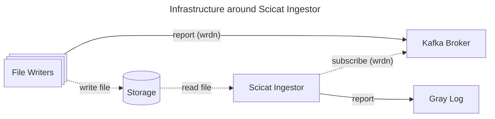

```mermaid
---
title: Infrastructure around Scicat Ingestor
---
graph LR
    filewriter@{ shape: processes, label: "File Writers" } -.write file.-> storage[(Storage)]
    filewriter --report (wrdn)--> kafkabroker[Kafka Broker]
    ingestor[Scicat Ingestor] -.subscribe (wrdn).-> kafkabroker
    storage -.read file.-> ingestor
    ingestor --report--> log[Gray Log]

```
