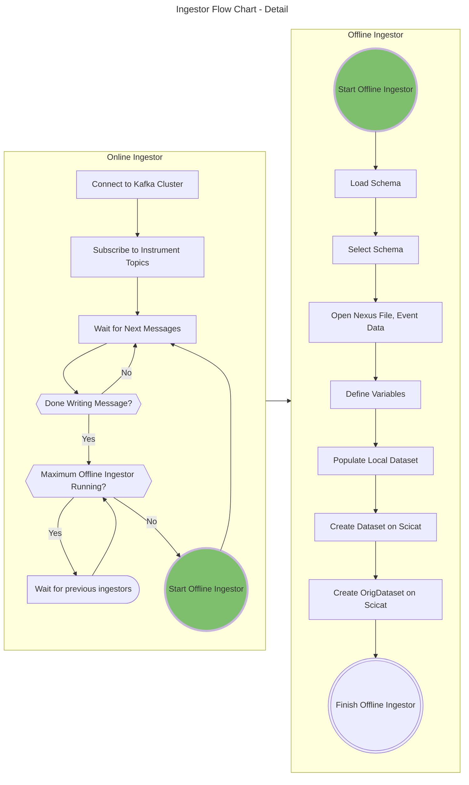

```mermaid
---
title: Ingestor Flow Chart - Detail
---
flowchart LR

    subgraph online [Online Ingestor]
        direction TB
        connect-to-kafka[Connect to Kafka Cluster] --> subscription[Subscribe to Instrument Topics]
        subscription --> wait[Wait for Next Messages]
        wait --> done{{Done Writing Message?}}
        done --> |No| wait
        done --> |Yes| max-process{{Maximum Offline Ingestor Running?}}
        max-process --> |Yes| wait-running@{ shape: delay , label: "Wait for previous ingestors"}
        wait-running --> max-process
        max-process --> |No| start@{shape: circle, label: "Start Offline Ingestor"}
        start --> wait
    end

    subgraph offline [Offline Ingestor]
        direction TB
        start-offline@{shape: circle, label: "Start Offline Ingestor"}
        start-offline --> load-schema[Load Schema]
        load-schema --> select[Select Schema]
        select --> open[Open Nexus File, Event Data]
        open --> variable[Define Variables]
        variable --> populate[Populate Local Dataset]
        populate --> create[Create Dataset on Scicat]
        create --> create-origdataset[Create OrigDataset on Scicat]
        create-origdataset --> stop@{shape: dbl-circ, label: "Finish Offline Ingestor"}

    end

    online --> offline

    style start fill:green,stroke-width:4px,opacity:0.5;
    style start-offline fill:green,stroke-width:4px,opacity:0.5;

```
