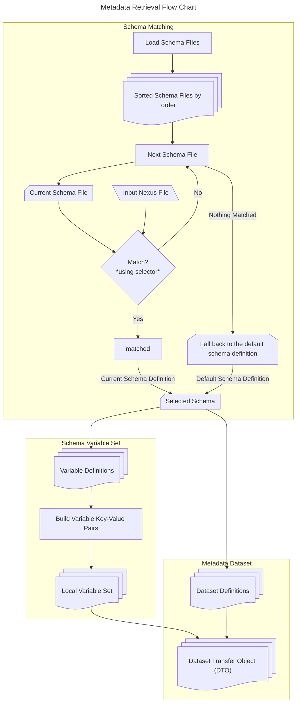

```mermaid
---
title: Metadata Retrieval Flow Chart
---
flowchart TB

    subgraph matching [Schema Matching]
        direction TB
        load-schema[Load Schema FIles] --> files@{shape: docs, label: "Sorted Schema Files by order"}
        files --> select[Next Schema File]
        select --> cur-schema@{shape: notch-rect, label: "Current Schema File"}
        cur-schema --> match{Match?<br>*using selector*}
        input-file@{shape: lean-l, label: "Input Nexus File"} --> match
        match --> |Yes| matched
        match --> |No| select
        select --> |Nothing Matched| no-match@{shape: loop-limit, label: "Fall back to the default schema definition"}
        matched --> |Current Schema Definition| selected@{shape: notch-rect, label: "Selected Schema"}
        no-match --> |Default Schema Definition| selected
    end

    subgraph variables [Schema Variable Set]
        direction TB
        selected --> variable-definitions@{shape: docs, label: "Variable Definitions"}
        variable-definitions --> build-variable-set[Build Variable Key-Value Pairs]
        build-variable-set --> local-variable-set@{shape: docs, label: "Local Variable Set"}
    end

    subgraph dataset [Metadata Dataset]
        direction TB
        selected --> dataset-definitions@{shape: docs, label: "Dataset Definitions"}
        local-variable-set --> dto@{shape: docs, label: "Dataset Transfer Object (DTO)"}
        dataset-definitions --> dto
    end

```
