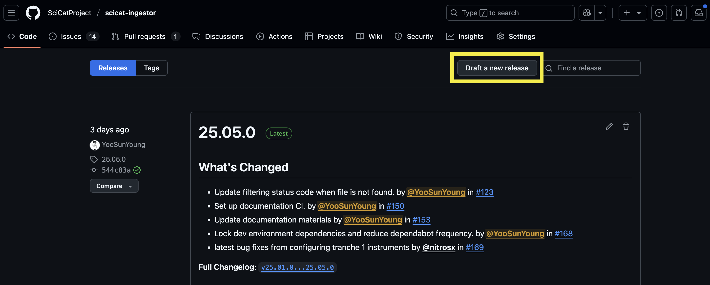
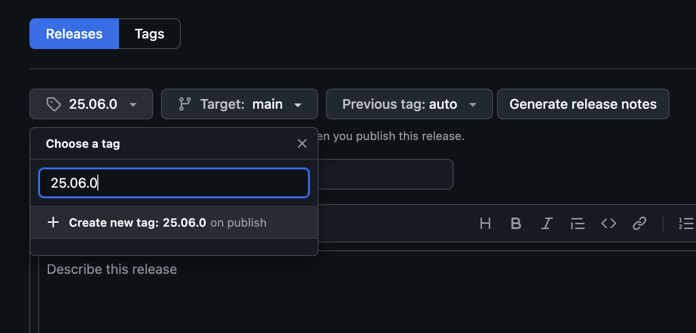
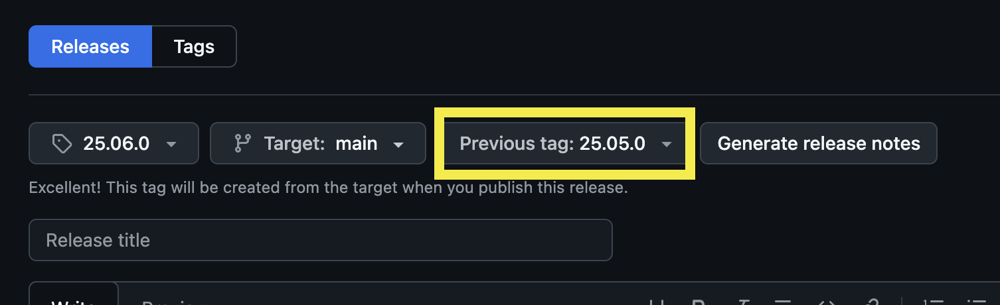
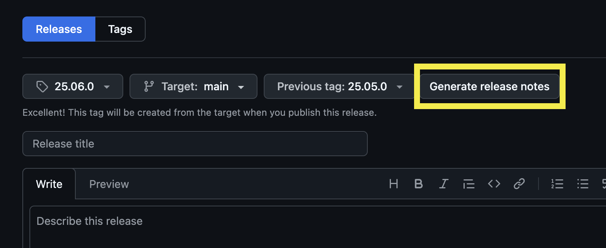
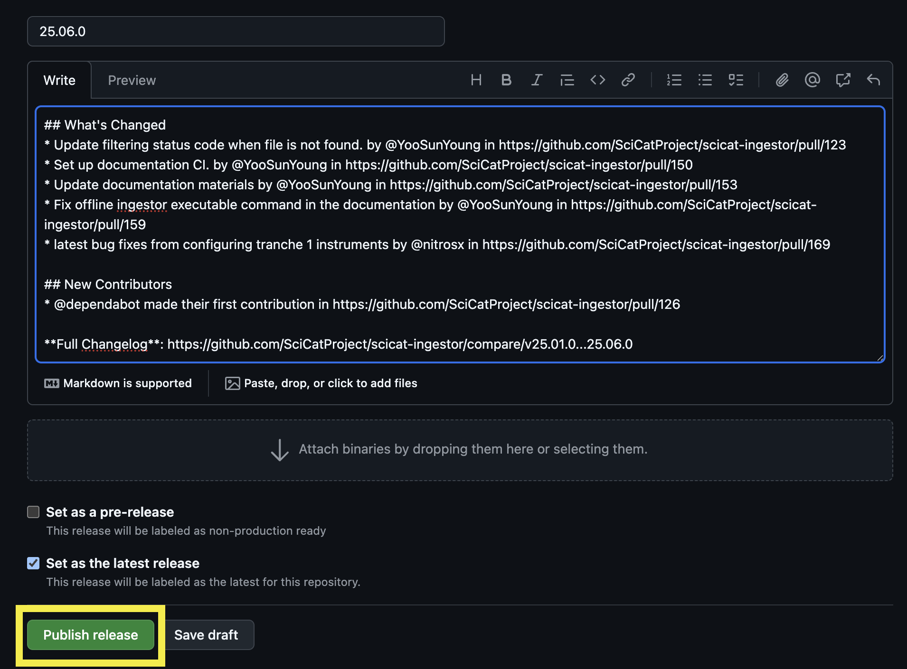
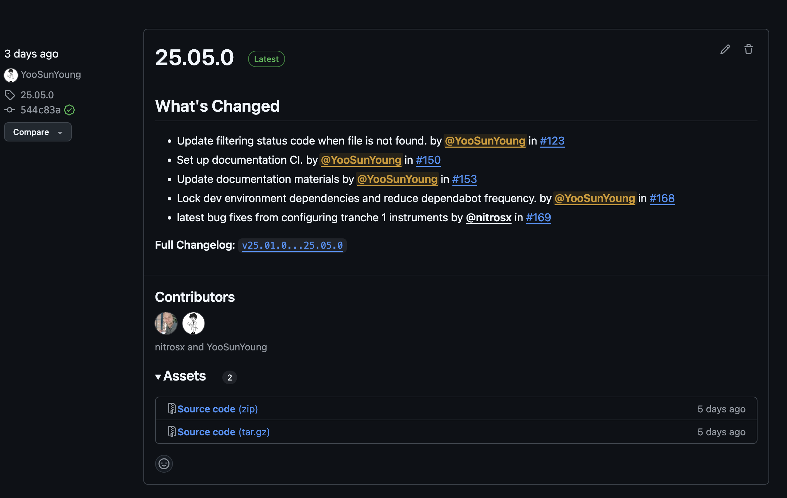

# Release and Deployment

Currently the `scicat-ingestor` is not deployed to any package indexing services, like `pypi` or `anaconda`. 
It is expected to be installed from the source code, which is available from the [github repository](https://github.com/SciCatProject/scicat-ingestor/). 

## TL;DR - Releasing `scicat-ingestor`

- Publish and tag the main branch with the version number.
- Deploy new documentation from the release.

## Release Steps

Here is instruction of release steps in detail.

### 1. Go to github repository releases page

[Scicat Intestor Releases Page](https://github.com/SciCatProject/scicat-ingestor/releases)

### 2. Click `Draft a new release` button

### 3. Create a new tag (version number)

This will be the title of the release as well.

Version Format: `YY.MM.x`

- `YY`: Last two digits of the current year
- `MM`: Current month in two digits
- `x`: Patch version number of the current month.
        If it is the first version of this month, it should be `0`
        and if it is the second version of the month, it should be `1` and so on...

### 4. Select previous tag

Select the previous tag to compare the current version.

!!! note

    Finding previous tag automatically by setting it to `auto` does not work currently.

### 5. Generate release notes

Click the `Generate release notes` button to generate release notes.

Then it creates release notes based on the PR merges.

### 6. Edit release notes

`Generate release notes` button will create the release title and the notes based on the
PRs that have been merged since the `previous tag` you selected.

Under ``What's Changed`` notes, we can typically remove `Bump` PRs by `dependabot` or `copier update`.

You can add more notes if needed.

### 7. Publish release

Click the `Publish release` button to publish the release.

### 8. Check the documentation

Publishing the release should trigger the [documentation build/deploy action](https://github.com/SciCatProject/scicat-ingestor/actions/workflows/docs-release.yml).

!!! note

    This action might fail due to various reasons so please check if it is
    deployed correctly by checking the action status or the documentation url.

!!! warning

    This release action is not directly connected to the `scicat-ingestor` deployment
    at the ESS infrastructure.

    There is a separate CI/CD pipeline that pulls the latest release of `scicat-ingestor`.

### 9. 🎉 New release of the `scicat-ingestor` 🎉

The new release will look similar to this:

