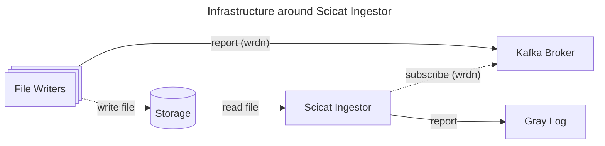
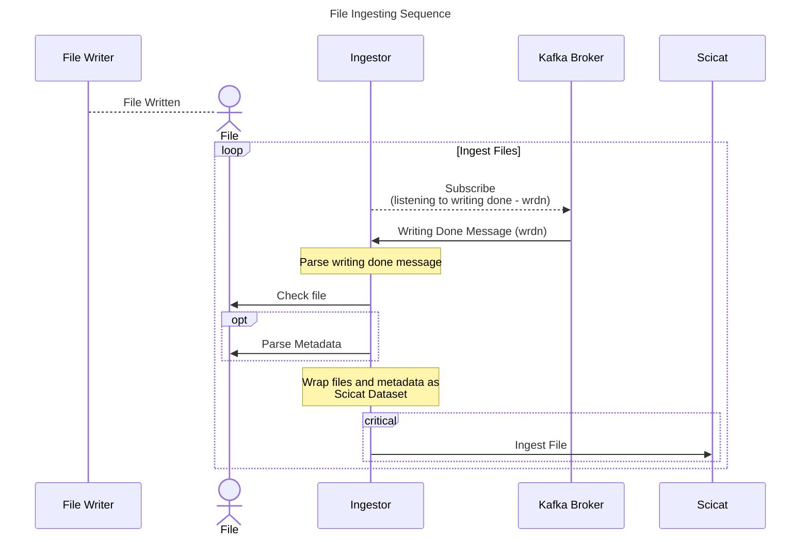

# Welcome to Scicat Ingestor

[](LICENSE)
[](documentatino/docs/CODE_OF_CONDUCT.md)

SciCat Ingestor is a versatile application with the primary focus to automate the ingestion of new dataset in to SciCat.

Scicat Ingestor aims to accomplish ``FAIR`` data <br>
by making files visible via `scicat`, associated with their metadata.

The project is composed of two main components:

- online ingestor

    is responsible to connect to a kafka cluster and listen to selected topics for a specific message and trigger the data ingestion by running the offline ingestor as a background process. At the moment, this is specific to ESS IT infrastructure, but it is already planned to generalize it as soon as other facilities express interest in adopting it.

    For details, see [online ingestor](user-guide/online-ingestor.md) page.

- offline ingestor

    can be run from the online ingestor or by an operator. It is responsible to collect all the necessary metadata and create a dataset entry in SciCat.

    For details, see [offline ingestor](user-guide/online-ingestor.md) page.


## Key Features

- Continuously and asynchronously retrieving information of `files` from kafka.
- Retrieve metadata from `files`.
- Ingest `files` along with retrieved metadata to `scicat`.

## Infrastructure around Scicat Ingestor

``scicat-ingestor`` is written for specific infrastructure setup like below:



| Framework | Required | Description |
| --------- | -------- | ----------- |
| [Scicat](https://www.scicatproject.org/) | O  | Scicat service that `scicat ingestor` can ingest files to. |
| [Kafka](https://kafka.apache.org/)       | O  | Kafka broker that `scicat ingestor` can receive `write done` messages from.<br>All messages are assumed to be serialized<br>as flatbuffer using these schema: [flatbuffer schemas for filewriter](https://github.com/ess-dmsc/streaming-data-types)<br>`scicat-ingestor` uses [python wrapper of those schemas](https://github.com/ess-dmsc/python-streaming-data-types) to deserialize messages.<br>Currently only [`wrdn`](https://github.com/ess-dmsc/streaming-data-types/blob/master/schemas/wrdn_finished_writing.fbs) schema is used. |
| [File Writer](https://github.com/ess-dmsc/kafka-to-nexus) | O and X | Any process that can write files and produce `write done` messages can be used. |
| [GrayLog](https://graylog.org/) | X - optional | `scicat ingestor` has built in `stdout` logging option. |

<br>

## File Ingesting Sequence

Here is a simple overview of how the ingestion is done.



<br><br>

Here is the typical file writing sequence including when the files are created/open.

<details>
    <summary>
        Click to see the File Writing Sequence
    </summary>
        ```mermaid
        sequenceDiagram
        loop File Writing
            File Writer -->> Kafka Broker: Subscribe (run start)
            Kafka Broker ->> File Writer: Run Start
            create actor File
            File Writer ->> File: Create File and Close
            File Writer --> File: Open File as Append Mode
            loop File Writing
                File Writer -->> Kafka Broker: Subscribe Relevant Topics for the run
                Kafka Broker ->> File Writer: Detector Data/Log/etc ...
                File Writer ->> File: Write Data in the File.
            end
            Kafka Broker ->> File Writer: Run Stop
            File Writer --> File: Close File.
            Note over File Writer: Compose wrdn message including id and file path
        File Writer ->> Kafka Broker: Report (writing done - wrdn)
        end

        ```
</details>

## Used At

``scicat ingestor`` is mainly maintained by [`ESS DMSC`](https://ess.eu/data-management-software-centre)
but it can be used in any systems that have same infrastructure set up.

### European Spallation Source
<div class="logo">
    <a href="https://ess.eu/">
        
    </a>
</div>

## Quick Start

We do not release `scicat-ingestor` into any package index services.<br>
You can directly download it from our github page.

```
git clone https://github.com/SciCatProject/scicat-ingestor.git
cd scicat-ingestor
git fetch origin
git checkout v25.01.0  # Latest Version
pip install -e .  # It will allow you to use entry-points of the scripts,
                  # defined in ``pyproject.toml``, under ``[project.scripts]`` section.
```

## Contribution
Anyone is welcome to contribute to our project.

Please check our [``developer guide``](developer-guide/getting-started).
