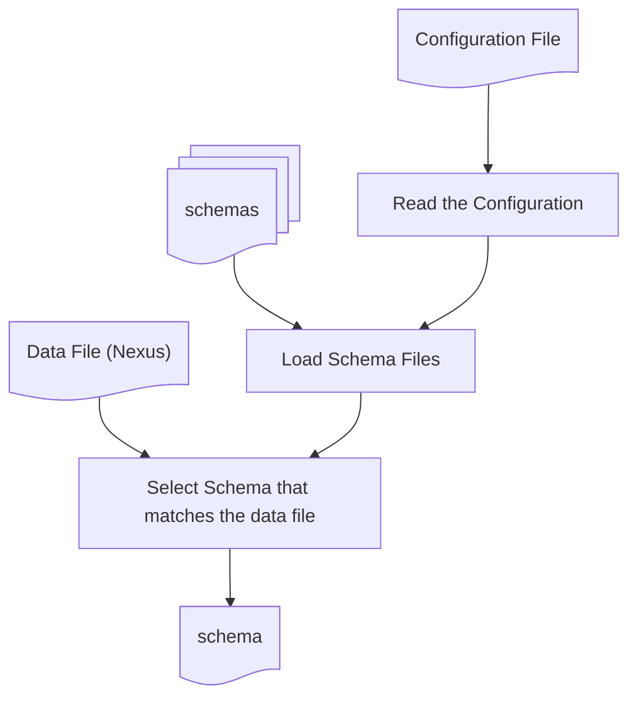

# Offline Ingestor

``offline-ingestor`` is a simple command line interface.
When it is called, ``offline-ingestor`` ingests one data file according to a specific schema file (.imsc.json).

!!! tip

    If you are looking for a python interface that you can use to download/upload dataset occasionally, you should use [``scitacean``](https://www.scicatproject.org/scitacean/).

    <details>
    <summary>But... why?</summary>
    `offline-ingestor` is for `raw` datasets that are continuously produced by `daq` programs. It has very limited/low-level interface to communicate with scicat because it is expecting only certain types of files with known structure. (i.e. nexus file written by `ess-file-writer`.) Therefore it can't handle arbitrary type of files. `scitacean`, however, provides versatile high-level interfaces to process files and communicate with scicat with various authentication methods.<br>
    `scitacean` can also validate a dataset before it is uploaded or after it is downloaded and `scitacean` will provide informative error messages.
    </details>


!!! note

    Currently the `offline ingestor` can only ingest [`nexus(hdf5)`](https://www.nexusformat.org/) format.
    Other formats can be supported only if necessary. Please contact us on our github page or via your ESS, DMSC contact person.

    For more information about the schema files, the variables and schema sections of such files, please consult the [schemas documentation](./metadata-schemas.md)


## How to Run

In the production environment, the `offline ingestor` is executed by the `online ingestor` as a background process. <br>
The `online ingestor` executes following command: <br>
```bash
<path to the scicat offline ingestor executable> \
    -c <full_path_to_the_configuration_file> \
    --nexus-file <full_path_to_the_nexus_data_file>

```

Such command can also be run manually in a terminal in case of need (aka automatic ingestion failed) or troubleshooting.

For example, if you want to ingest a file at `/ess/data/coda/2025/123321/raw/123321_000123456.hdf`,<br>
the command could be:

```bash
conda activate scicat-ingestor
scicat_background_ingestor \
    -c /ess/services/scicat-ingestor/config/scicat_ingestor_config.json \
    --nexus-file /ess/data/coda/2025/123321/raw/123321_000123456.hdf
```

or if you want to run the ingestor module directly,

```bash
/root/micromamba/envs/scicat-ingestor/bin/python -m /ess/services/scicat-ingestor/software/src/scicat_offline_ingestor.py \
    -c /ess/services/scicat-ingestor/config/scicat_ingestor_config.json \
    --nexus-file /ess/data/coda/2025/123321/raw/123321_000123456.hdf

```

## Flow

### Ingestor Flow Diagram


### Ingestor Flow Description
- read the configuration
- load the schema files
- select the schema file that matches the data file
- retrieve all the required values and assign them to internally defined `variables` according to the `_variables_` section of the schema file
- prepare `local representation of the dataset`, assigning field values according to the `_schema_` section of the schema file
- prepare `local representation of the file list` according to the provided configuration
- send a `POST` request to the SciCat instance of reference to create the `dataset`
- send a `POST` request to the SciCat instance of reference to create the `origdatablock` containing the list of files
